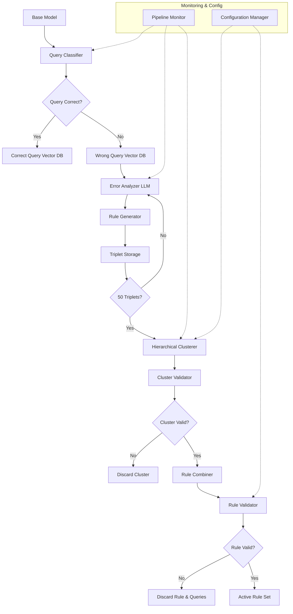
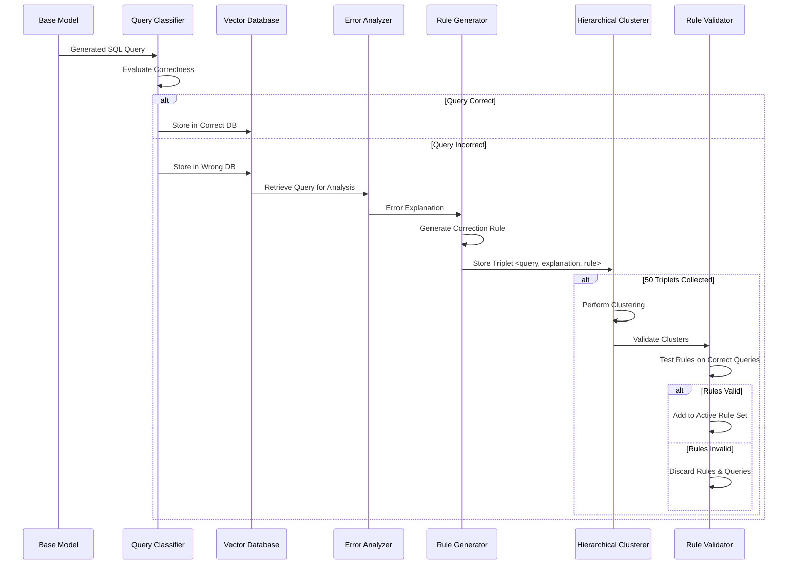

# Design Document

## Overview

The error correction pipeline is a sophisticated machine learning system that automatically learns from SQL generation errors to create and validate correction rules. The system processes queries through multiple stages: classification, storage, analysis, rule generation, clustering, and validation. This creates a feedback loop that continuously improves SQL generation accuracy by learning from mistakes.

The pipeline integrates with the existing text-to-SQL system while maintaining separation of concerns, allowing it to operate during training without affecting inference performance.

## Architecture

### High-Level Architecture



### Data Flow Architecture



## Components and Interfaces

### 1. QueryClassifier Class

**Purpose**: Determines correctness of generated SQL queries

**Key Methods**:
- `classify_query(sql_query, expected_result, db_id)`: Evaluates query correctness
- `get_classification_confidence()`: Returns confidence score for classification
- `set_evaluation_criteria(criteria)`: Configures evaluation parameters

**Integration**:
- Uses existing evaluation functions from `evaluation.py` and `exec_eval.py`
- Maintains consistency with current evaluation metrics
- Supports both execution-based and result-based evaluation

### 2. VectorDatabase Class

**Purpose**: Manages storage and retrieval of correct and incorrect queries

**Key Methods**:
- `store_correct_query(query, metadata)`: Stores correct query with embeddings
- `store_incorrect_query(query, error_info, metadata)`: Stores incorrect query
- `similarity_search(query, k=10)`: Finds similar queries
- `get_query_statistics()`: Returns database statistics

**Storage Schema**:
```python
{
    "query_id": "unique_identifier",
    "sql_query": "SELECT * FROM table",
    "natural_language": "original question",
    "db_id": "database_identifier", 
    "embedding": [0.1, 0.2, ...],
    "metadata": {
        "timestamp": "2024-01-01T00:00:00",
        "model_version": "v1.0",
        "error_type": "syntax|semantic|logical",
        "confidence_score": 0.85
    }
}
```

### 3. ErrorAnalyzer Class

**Purpose**: Generates explanations for incorrect SQL queries

**Key Methods**:
- `analyze_error(sql_query, expected_result, actual_result)`: Generates error explanation
- `categorize_error(explanation)`: Classifies error type
- `get_analysis_quality_score()`: Returns explanation quality metric

**Error Categories**:
- **Syntax Errors**: Invalid SQL syntax, missing keywords, incorrect operators
- **Semantic Errors**: Wrong table/column references, type mismatches
- **Logical Errors**: Incorrect query logic, missing conditions, wrong aggregations

**Explanation Format**:
```python
{
    "error_type": "semantic",
    "primary_issue": "Incorrect table join",
    "detailed_explanation": "The query joins tables A and B on wrong columns...",
    "affected_components": ["FROM clause", "JOIN condition"],
    "suggested_correction": "Use table.id = other_table.foreign_id",
    "confidence": 0.92
}
```

### 4. RuleGenerator Class

**Purpose**: Creates correction rules based on error explanations

**Key Methods**:
- `generate_rule(query, explanation)`: Creates correction rule
- `validate_rule_applicability(rule, query)`: Tests rule on original query
- `generalize_rule(rule)`: Makes rule applicable to similar cases

**Rule Format**:
```python
{
    "rule_id": "unique_identifier",
    "rule_type": "join_correction|aggregation_fix|column_mapping",
    "condition": {
        "error_pattern": "joins table A and B without proper key",
        "query_pattern": "SELECT * FROM A JOIN B ON A.name = B.name"
    },
    "correction": {
        "action": "replace_join_condition",
        "replacement": "A.id = B.a_id",
        "explanation": "Use primary key to foreign key relationship"
    },
    "applicability_score": 0.85,
    "test_cases": ["query1", "query2", ...]
}
```

### 5. HierarchicalClusterer Class

**Purpose**: Groups similar queries and rules using clustering algorithms

**Key Methods**:
- `cluster_triplets(triplets, threshold)`: Performs hierarchical clustering
- `validate_cluster(cluster)`: Tests cluster coherence
- `combine_rules(cluster)`: Merges rules within cluster
- `get_cluster_representative(cluster)`: Selects best representative query

**Clustering Algorithm**:
1. **Feature Extraction**: Convert queries to feature vectors (embeddings + structural features)
2. **Distance Calculation**: Use cosine similarity for embeddings + edit distance for SQL structure
3. **Hierarchical Clustering**: Apply agglomerative clustering with configurable linkage
4. **Cluster Validation**: Test representative queries against combined rules
5. **Iterative Refinement**: Merge successful clusters, discard failed ones

### 6. RuleValidator Class

**Purpose**: Validates correction rules against correct queries

**Key Methods**:
- `validate_rule(rule, sample_queries)`: Tests rule on correct queries
- `sample_correct_queries(n)`: Selects representative correct queries
- `apply_rule_to_query(rule, query)`: Applies correction rule
- `calculate_rule_impact(rule)`: Measures rule effectiveness

**Validation Process**:
1. **Sample Selection**: Choose diverse correct queries from vector database
2. **Rule Application**: Apply correction rule to sampled queries
3. **Result Verification**: Ensure queries remain correct after rule application
4. **Impact Assessment**: Measure improvement on incorrect queries
5. **Decision Making**: Accept or reject rule based on validation results

## Data Models

### TripletData

```python
@dataclass
class TripletData:
    query_id: str
    sql_query: str
    natural_language: str
    db_id: str
    error_explanation: ErrorExplanation
    correction_rule: CorrectionRule
    timestamp: datetime
    confidence_scores: Dict[str, float]
```

### ErrorExplanation

```python
@dataclass
class ErrorExplanation:
    error_type: str
    primary_issue: str
    detailed_explanation: str
    affected_components: List[str]
    suggested_correction: str
    confidence: float
    analysis_metadata: Dict[str, Any]
```

### CorrectionRule

```python
@dataclass
class CorrectionRule:
    rule_id: str
    rule_type: str
    condition: Dict[str, Any]
    correction: Dict[str, Any]
    applicability_score: float
    test_cases: List[str]
    validation_results: Dict[str, Any]
```

### ClusterData

```python
@dataclass
class ClusterData:
    cluster_id: str
    triplets: List[TripletData]
    representative_query: str
    combined_rule: CorrectionRule
    cluster_metrics: Dict[str, float]
    validation_status: str
```

## Error Handling

### Pipeline Error Categories

1. **Classification Errors**: Incorrect query correctness determination
2. **Analysis Errors**: Failed error explanation generation
3. **Rule Generation Errors**: Invalid or non-applicable rules
4. **Clustering Errors**: Failed cluster formation or validation
5. **Validation Errors**: Rule validation failures

### Error Recovery Strategies

1. **Graceful Degradation**: Continue pipeline with reduced functionality
2. **Retry Mechanisms**: Retry failed operations with different parameters
3. **Fallback Strategies**: Use simpler approaches when complex methods fail
4. **Quality Monitoring**: Track and alert on pipeline quality degradation

### Monitoring and Alerting

```python
{
    "pipeline_metrics": {
        "queries_processed": 1000,
        "classification_accuracy": 0.95,
        "rule_generation_rate": 0.78,
        "cluster_success_rate": 0.82,
        "rule_validation_rate": 0.71
    },
    "quality_metrics": {
        "explanation_quality": 0.87,
        "rule_applicability": 0.73,
        "correction_effectiveness": 0.69
    },
    "alerts": [
        {
            "type": "quality_degradation",
            "component": "error_analyzer",
            "threshold": 0.8,
            "current_value": 0.75
        }
    ]
}
```

## Testing Strategy

### Unit Testing

1. **Component Testing**: Test each pipeline component independently
2. **Rule Testing**: Validate rule generation and application logic
3. **Clustering Testing**: Test clustering algorithms with known datasets
4. **Validation Testing**: Test rule validation with controlled query sets

### Integration Testing

1. **End-to-End Pipeline**: Test complete pipeline with sample datasets
2. **Database Integration**: Test vector database operations and performance
3. **LLM Integration**: Test error analysis and rule generation with various LLMs
4. **Performance Testing**: Validate pipeline performance under load

### Quality Assurance

1. **Rule Quality Assessment**: Human evaluation of generated rules
2. **Explanation Quality**: Expert review of error explanations
3. **Correction Effectiveness**: Measure improvement in SQL generation accuracy
4. **Bias Detection**: Test for systematic biases in rule generation

## Performance Considerations

### Scalability

- **Batch Processing**: Support for processing large datasets efficiently
- **Parallel Processing**: Concurrent analysis and rule generation
- **Database Optimization**: Efficient vector similarity search and storage
- **Memory Management**: Handle large rule sets and query collections

### Optimization Strategies

- **Caching**: Cache frequently accessed queries and rules
- **Incremental Learning**: Update rules incrementally rather than full reprocessing
- **Pruning**: Remove ineffective or outdated rules
- **Load Balancing**: Distribute processing across multiple workers

## Configuration Management

### Pipeline Configuration

```python
{
    "classification": {
        "evaluation_timeout": 30,
        "confidence_threshold": 0.8,
        "use_execution_based": true
    },
    "error_analysis": {
        "llm_model": "gpt-4",
        "max_analysis_time": 60,
        "quality_threshold": 0.8
    },
    "rule_generation": {
        "min_applicability_score": 0.7,
        "max_rules_per_explanation": 3,
        "generalization_level": "moderate"
    },
    "clustering": {
        "min_triplets": 50,
        "similarity_threshold": 0.75,
        "min_cluster_size": 3,
        "combination_threshold_percent": 70
    },
    "validation": {
        "sample_size": 100,
        "validation_threshold": 0.85,
        "max_validation_time": 300
    }
}
```