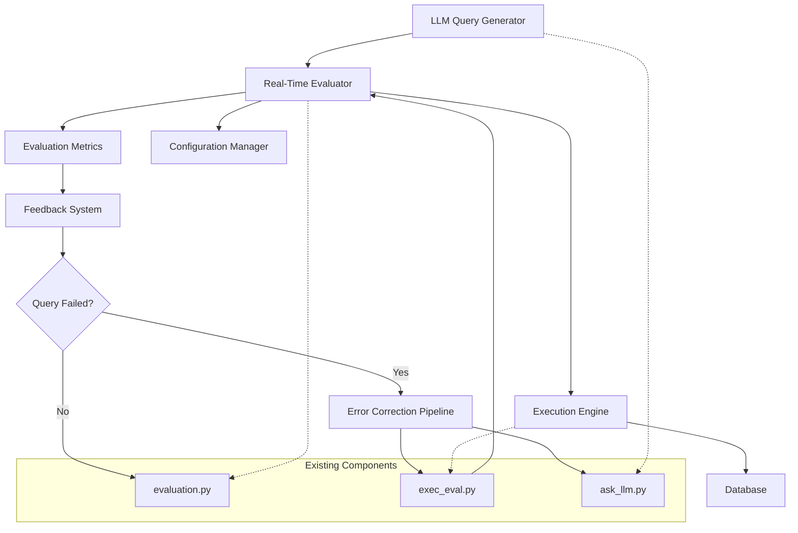

# Design Document

## Overview

The real-time SQL evaluation feature integrates immediate query validation into the existing text-to-SQL generation pipeline. This design extends the current system by adding evaluation capabilities directly after query generation, providing instant feedback without disrupting the existing batch evaluation workflow.

The solution introduces a new `RealTimeEvaluator` class that wraps the existing evaluation functions from `evaluation.py` and `exec_eval.py`, enabling both immediate validation and maintaining compatibility with current evaluation metrics.

## Architecture

### High-Level Architecture



### Component Integration

The real-time evaluation system integrates with existing components:

- **LLM Integration**: Hooks into the query generation process in `ask_llm.py`
- **Evaluation Reuse**: Leverages existing functions from `evaluation.py` and `exec_eval.py`
- **Database Execution**: Uses current database connection and execution logic
- **Configuration**: Extends existing configuration patterns for enabling/disabling features

## Components and Interfaces

### 1. RealTimeEvaluator Class

**Purpose**: Main orchestrator for real-time evaluation

**Key Methods**:
- `evaluate_query(sql_query, db_id, gold_query=None)`: Evaluates a single query
- `configure(config)`: Sets evaluation parameters and modes
- `get_evaluation_results()`: Returns structured evaluation results

**Integration Points**:
- Imports and uses functions from `evaluation.py`
- Calls execution functions from `exec_eval.py`
- Provides results in format compatible with existing result processing

### 2. EvaluationConfig Class

**Purpose**: Manages configuration for real-time evaluation

**Configuration Options**:
- `enabled`: Boolean to enable/disable real-time evaluation
- `timeout`: Query execution timeout (default: 60 seconds)
- `evaluation_mode`: "execution_only", "full_evaluation", or "metrics_only"
- `verbose_logging`: Enable detailed logging for debugging
- `batch_compatibility`: Maintain compatibility with batch evaluation results

### 3. QueryExecutor Class

**Purpose**: Handles immediate SQL query execution

**Key Methods**:
- `execute_sql(query, db_path)`: Executes SQL against database
- `validate_syntax(query)`: Checks SQL syntax before execution
- `get_execution_stats()`: Returns timing and performance metrics

**Error Handling**:
- Syntax error detection and reporting
- Runtime error capture with detailed messages
- Timeout handling for long-running queries

### 4. FeedbackFormatter Class

**Purpose**: Formats evaluation results for different output needs

**Output Formats**:
- Structured JSON for programmatic use
- Human-readable text for debugging
- Compatible format with existing result files
- Real-time streaming output for immediate feedback

### 5. ErrorCorrectionPipeline Class

**Purpose**: Automatically corrects failed SQL queries based on evaluation feedback

**Key Methods**:
- `correct_query(sql_query, error_info, db_schema)`: Attempts to fix a failed query
- `analyze_error(error_info)`: Determines correction strategy based on error type
- `apply_correction_strategy(query, strategy)`: Applies specific correction techniques

**Correction Strategies**:
- Syntax error fixing (missing keywords, incorrect operators)
- Schema alignment (table/column name corrections)
- Semantic corrections (JOIN conditions, WHERE clause fixes)
- Value type corrections (string quoting, number formatting)

### 6. CorrectionTracker Class

**Purpose**: Tracks correction attempts and prevents infinite loops

**Key Methods**:
- `track_attempt(query_id, original_query, corrected_query)`: Records correction attempt
- `should_continue_correction(query_id)`: Checks if more attempts are allowed
- `get_correction_history(query_id)`: Returns all correction attempts for a query

## Data Models

### EvaluationResult

```python
@dataclass
class EvaluationResult:
    query_id: str
    sql_query: str
    db_id: str
    execution_success: bool
    execution_time: float
    result_rows: List[Tuple]
    error_message: Optional[str]
    evaluation_scores: Dict[str, float]
    timestamp: datetime
    
    # Compatibility with existing evaluation
    exact_match: bool
    execution_accuracy: bool
    partial_match_score: float
    
    # Error correction tracking
    is_corrected: bool = False
    original_query: Optional[str] = None
    correction_attempts: int = 0
    correction_history: List[str] = field(default_factory=list)
```

### CorrectionAttempt

```python
@dataclass
class CorrectionAttempt:
    attempt_number: int
    original_query: str
    corrected_query: str
    error_type: str
    correction_strategy: str
    success: bool
    timestamp: datetime
    error_message: Optional[str] = None
```

### EvaluationConfig

```python
@dataclass
class EvaluationConfig:
    enabled: bool = False
    timeout: int = 60
    evaluation_mode: str = "full_evaluation"
    verbose_logging: bool = False
    batch_compatibility: bool = True
    output_format: str = "json"
    immediate_feedback: bool = True
```

## Error Handling

### Error Categories

1. **Syntax Errors**: Invalid SQL syntax detected before execution
2. **Runtime Errors**: Database execution failures (table not found, column errors, etc.)
3. **Timeout Errors**: Queries exceeding configured timeout limits
4. **Configuration Errors**: Invalid evaluation configuration settings

### Error Response Format

```python
{
    "error_type": "syntax_error|runtime_error|timeout_error|config_error",
    "error_message": "Detailed error description",
    "error_location": "Specific location in SQL if applicable",
    "suggested_fix": "Actionable suggestion for fixing the error",
    "query_fragment": "Problematic part of the query"
}
```

### Graceful Degradation

- If real-time evaluation fails, the system continues with query generation
- Evaluation errors are logged but don't interrupt the main workflow
- Fallback to batch evaluation if real-time evaluation is unavailable

## Testing Strategy

### Unit Testing

1. **RealTimeEvaluator Tests**:
   - Test query evaluation with valid SQL
   - Test error handling for invalid SQL
   - Test timeout behavior
   - Test configuration changes

2. **QueryExecutor Tests**:
   - Test SQL execution against sample databases
   - Test syntax validation
   - Test performance metrics collection

3. **FeedbackFormatter Tests**:
   - Test output format generation
   - Test compatibility with existing result formats
   - Test error message formatting

### Integration Testing

1. **End-to-End Pipeline Tests**:
   - Test complete flow from query generation to evaluation
   - Test with various database schemas
   - Test performance under load

2. **Compatibility Tests**:
   - Verify results match existing evaluation.py output
   - Test backward compatibility with existing workflows
   - Validate metric consistency

### Performance Testing

1. **Latency Tests**:
   - Measure evaluation time for different query complexities
   - Test timeout behavior under various conditions
   - Benchmark against batch evaluation performance

2. **Concurrency Tests**:
   - Test multiple simultaneous evaluations
   - Test database connection pooling
   - Validate thread safety

## Implementation Phases

### Phase 1: Core Infrastructure
- Implement RealTimeEvaluator class
- Create EvaluationConfig management
- Basic SQL execution and error handling

### Phase 2: Integration
- Integrate with existing ask_llm.py workflow
- Implement feedback formatting
- Add configuration options

### Phase 3: Advanced Features
- Add detailed performance metrics
- Implement verbose logging and debugging
- Add support for batch comparison modes

### Phase 4: Optimization
- Performance tuning and optimization
- Advanced error analysis and suggestions
- Enhanced compatibility features